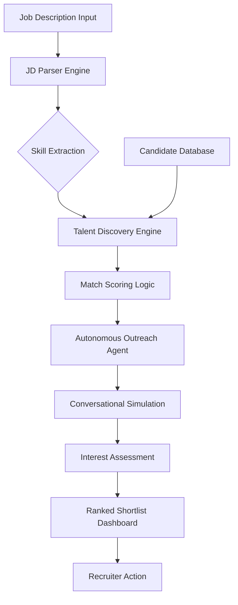

# Lumina Talent AI Agent 🚀

Lumina is an AI-powered talent scouting and engagement agent designed to streamline the recruitment funnel. It automates the tedious process of parsing JDs, discovering candidates, and performing initial outreach to gauge interest.

## 🌟 Features

- **JD Semantic Parsing**: Automatically extracts key skills and experience requirements from raw Job Descriptions.
- **Explainable Matching**: Calculates a "Match Score" based on skills, role, and experience, providing a clear rationale for every candidate.
- **Autonomous Experience Filtering**: The agent automatically detects minimum experience requirements from the JD text (e.g., "8+ years") and filters out under-qualified candidates instantly.
- **Large Candidate Pool**: Access to an expanded index of professional profiles (12 unique candidates in prototype).
- **Autonomous Engagement**: Simulates a conversational AI (Agent) that reaches out to candidates via chat to assess their current interest level with stable, deterministic results.
- **Dual-Metric Shortlist**: Ranks candidates based on a combined view of technical fit (**Match Score**) and genuine willingness (**Interest Score**).
- **Premium Agent Console**: Real-time visibility into the "thinking" process of the scouting agent.

## 🏗️ Architecture

## 🛠️ Tech Stack

- **Core**: HTML5, Vanilla JavaScript (ES6+)
- **Styling**: CSS3 (Glassmorphism, Dark Mode, Animations)
- **Engine**: Custom heuristic-based NLP simulation for JD parsing and conversational outreach.

## 🚀 Getting Started

### Local Setup
1. Clone the repository (or download the files).
2. Open `index.html` in any modern web browser.
3. No dependencies or build steps required for the prototype!

### How to Use
1. Paste a Job Description into the left sidebar.
2. Click **"Scout Candidates"**.
3. Watch the **Agent Console** as it parses, searches, and engages.
4. Review the generated shortlist. Click **"View Interaction"** to see the simulated chat history between the AI and the candidate.

## 📊 Scoring Logic
- **Match Score (100 pts)**:
    - **60% Skills Match**: Weighted overlap between JD requirements and candidate expertise.
    - **15% Role Alignment**: Title-based semantic matching.
    - **15% Experience Seniority**: Verification of years of experience against JD requirements.
    - **10% Bio Synergy**: Scanning professional bios for requirement keywords.
- **Interest Score (100 pts)**:
    - **40% Activity Factor**: Based on recency of platform activity (e.g., "Active now" vs "1 week ago").
    - **60% Engagement Baseline**: Deterministic profile-based interest factor for stability.

## 📝 Sample Input/Output

### Sample JD:
"Seeking a Senior Frontend Engineer with 5+ years of experience in React, TypeScript, and TailwindCSS. Must have experience with high-performance dashboards and data visualization."

### Sample Output (Example):
- **Candidate**: Elena Petrova
- **Match Score**: 76%
- **Interest Score**: 98% 
- **Status**: "Highly interested, requested immediate follow-up."

---
Developed for the AI Talent Scout Challenge. April 2026.
